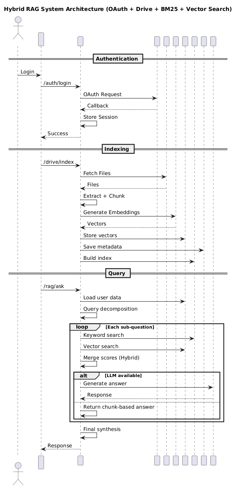

# High Watch

High Watch is a FastAPI and React app for indexing Google Drive files and answering questions over the indexed content with retrieval-augmented generation.

## What it does

- Connects to Google Drive with OAuth
- Extracts text from PDFs and Google Docs only
- Builds hybrid search with BM25 and FAISS when available
- Uses Groq for answer generation when configured
- Falls back to simpler search and response modes when optional dependencies are missing

## Project layout

- `backend/` contains the FastAPI app, authentication, retrieval pipeline, and vector store code
- `frontend/` contains the React UI
- `docs/` contains setup and API notes

## Backend structure

- `backend/app/config.py` holds environment and runtime settings
- `backend/core/` contains auth, embedding, and PDF helpers
- `backend/rag/` contains search, retrieval, and answer generation logic
- `backend/api/routes/` contains the HTTP route handlers


## System Architecture


## Setup

1. Create a `.env` file in the project root with the variables below.

```env
# Google OAuth (required)
CLIENT_ID=your_google_client_id_here
CLIENT_SECRET=your_google_client_secret_here

# Session (required)
SESSION_SECRET=replace-with-a-strong-random-secret

# App URLs
FRONTEND_URL=http://127.0.0.1:5173
REDIRECT_URI=http://localhost:8000/auth/callback

# LLM (optional)
GROQ_API_KEY=your_groq_api_key_here
GROQ_MODEL=llama-3.1-8b-instant

# Vector store paths (optional)
FAISS_INDEX_PATH=data/faiss_index.bin
METADATA_PATH=data/metadata.json
VECTOR_DATA_ROOT=data/users

# Search settings (optional)
BM25_WEIGHT=0.3
FAISS_WEIGHT=0.7
DEFAULT_SEARCH_K=5
```

Required variables are `CLIENT_ID`, `CLIENT_SECRET`, and `SESSION_SECRET`. The rest have sensible defaults or are optional.
2. Install backend dependencies with `pip install -r requirements.txt`.
3. Start the backend from the `backend/` folder with `python -m uvicorn app.main:app --reload`.
4. Install frontend dependencies in `frontend/` with `npm install` and run `npm run dev`.

## API

The service exposes endpoints for:

- authentication
- listing and downloading Drive files
- indexing files into the vector store
- hybrid search
- question answering
- health checks

See `docs/API.md` for request and response details.

## Why the structure changed

The code was split into smaller modules to make it easier to read, test, and change. Configuration was centralized, retrieval logic was separated from route handlers, and the search pipeline was broken into focused pieces so individual parts can be improved without changing the whole app.

## Notes

- The system works without every optional dependency installed.
- Vector data is stored under `backend/data/`.
- Generated index files can be rebuilt by running the indexing flow again.
